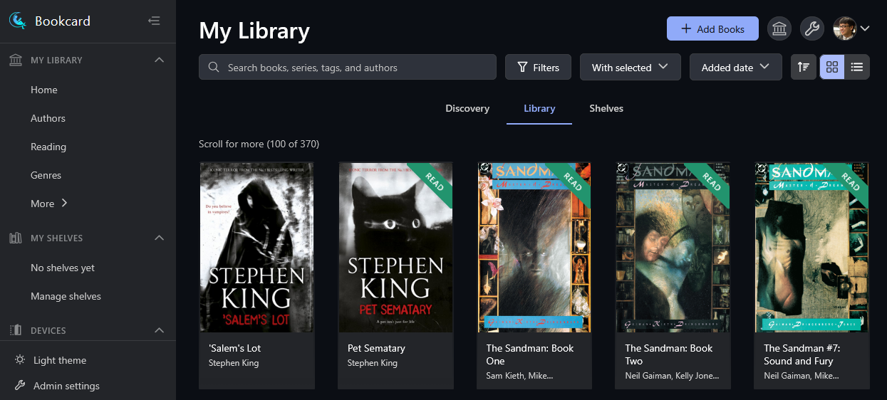

# Bookcard

> A modern, self-hosted ebook management and reading platform.

<div align="center"></div>

**10-second pitch:** Bookcard is a web-based ebook library manager like calibre-web but built with modern technologies. Browse and read your ebook collection without the bloat.

- 🚀 Fast: built with Next.js and FastAPI for performance
- 📚 Complete: feature-rich web reader, metadata enrichment, format conversion, and more
- 🔒 Self-hosted: full control over your data and privacy
- 🎨 Modern: responsive interface that works on desktop and mobile

<div align="center"></div>

---

## Table of Contents

1. [About](#about)
2. [Features](#features)
3. [Installation](#installation)
   - [Docker](#docker)
   - [Development](#development)
4. [Contributing](#contributing)
5. [License](#license)

---

## About

Bookcard provides a modern alternative to existing Calibre-based solutions. While **Calibre** is a powerful desktop application and **calibre-web** offers a web interface, both rely on older technologies and tight coupling with Calibre's database.

Bookcard differentiates itself by:

- **Modern architecture**: Next.js frontend and FastAPI backend
- **User-friendly**: Bring your own `metadata.db` (existing Calibre library), or not; the app will work either way
- **Advanced metadata**: Library-wide scanning linking books to authoritative databases
- **Clean architecture**: Proper separation of concerns for easier maintenance

## Features

- **Web-based reading**: Read ebooks directly in your browser with customizable themes and font sizes
- **Library management**: Organize books into shelves, search and filter your collection
- **Metadata enrichment**: Automatic fetching from multiple providers (Google Books, Open Library, Hardcover, Amazon, Comic Vine, and more)
- **Library scanning**: Background process linking your library to authoritative databases
- **Format support**: EPUB, PDF, MOBI, AZW3, FB2, and more with built-in conversion
- **Device integration**: Send books to e-readers via email
- **OPDS support**: Access your library via OPDS-compatible apps
- **Multi-user**: Role-based permissions and user management
- **REST API**: Comprehensive API for automation

## Installation

### Docker

> [!IMPORTANT]
> These instructions assume Docker and Docker Compose are installed. If not, follow the [Docker installation guide](https://docs.docker.com/get-docker/).

1. **Clone the repository**

   ```bash
   git clone https://github.com/bookcard-io/bookcard.git
   cd bookcard
   ```

2. **Configure environment**

   Create a `.env` file in the project root:

   ```bash
   ADMIN_USERNAME=admin
   ADMIN_EMAIL=admin@example.com
   ADMIN_PASSWORD=your-secure-password
   BOOKCARD_JWT_SECRET=your-jwt-secret-key
   ```

3. **Configure library paths**

   Update volume mounts in `infra/docker-compose.yaml`:

   ```yaml
   volumes:
     - /path/to/your/calibre/library:/books
     - ~/.bookcard:/data
     - /path/to/books/ingest:/data/books_ingest
   ```

4. **Start the application**

   ```bash
   docker compose -f infra/docker-compose.yaml up -d
   ```

   Access at:
   - Frontend: http://localhost:3000
   - API: http://localhost:8000
   - API Docs: http://localhost:8000/docs

For detailed instructions, see the [Installation Guide](docs/user-guide/installation.md).

### Development

1. **Prerequisites**

   - Python 3.12+
   - Node.js 22+
   - uv (Python package manager)

2. **Install dependencies**

   ```bash
   curl -LsSf https://astral.sh/uv/install.sh | sh
   uv venv
   source .venv/bin/activate
   uv sync --group dev
   cd web && npm install && cd ..
   ```

3. **Configure and start**

   Create a `.env` file:

   ```bash
   BOOKCARD_JWT_SECRET=dev-secret-key
   ADMIN_USERNAME=admin
   ADMIN_EMAIL=admin@example.com
   ADMIN_PASSWORD=admin123
   ```

   Start development servers:

   ```bash
   make dev
   ```

For more details, see the [Developer Guide](docs/developers/setup.md).

## Contributing

1. Create a feature branch from `main`
2. Make your changes following the [code style guidelines](docs/developers/code-style.md)
3. Write/update tests and run `make test`
4. Format code with `make format`
5. Submit a pull request

See the [Developer Workflow Guide](docs/developers/workflow.md) for details.

## License

This project is licensed under the GNU General Public License v3.0 (GPL-3.0-or-later). See the [LICENSE](LICENSE) file for details.
