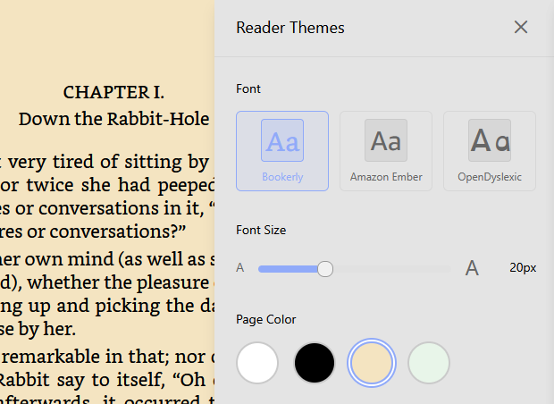

<h1 style="margin: 0; display: inline;">Bookcard</h1>

A Modern Self-Hosted Ebook Platform

<strong>Your entire library, beautifully organized.</strong> Open EPUB, PDF, MOBI, AZW3, FB2, and more. Browse your library with a modern, responsive interface. Read directly in your browser with customizable themes, fonts, and layouts. Works seamlessly on desktop, tablet, and mobile devices.

<strong>Organize your collection with ease.</strong> Create custom shelves, search and filter your books, and manage metadata with automatic enrichment from multiple providers. Import your existing Calibre library or start fresh—Bookcard works either way.

<strong>Enrich your library automatically.</strong> Bookcard scans your collection and links books to authoritative databases. Fetch covers, descriptions, and metadata automatically, or edit manually when needed.

<strong>Read anywhere, on any device.</strong> Adjust fonts, spacing, margins, and color schemes. Track your reading progress and pick up where you left off on any device.

<strong>Send books to your e-reader.</strong> Send books via email with one click. Works with Kindle, Kobo, and other e-readers that support email delivery.

<strong>Extend with a powerful API.</strong> Bookcard provides a feature-rich, well-documented, and fully extensible REST API. Integrate with your tools, automate workflows, and build custom applications. <a href="api/overview">View API Documentation</a>

<strong>Open source.</strong> Bookcard is free software: you can redistribute it and/or modify it under the terms of the GNU General Public License.

## Get Bookcard

[Installation Guide](user-guide/installation.md) | [User Guide](user-guide/usage.md) | [API Documentation](api/overview.md)

### Quick Start

1. [Install Bookcard](user-guide/installation.md)
2. [Configure your library](user-guide/usage.md)
3. [Start reading](user-guide/usage.md#reading-books)

For detailed instructions, see the [Installation Guide](user-guide/installation.md).

## Documentation

- **[User Guide](user-guide/installation.md)**: Installation, configuration, and usage instructions
- **[API Documentation](api/overview.md)**: REST API reference for developers
- **[Developer Guide](developers/architecture.md)**: Architecture, contributing, and development setup

## Getting Help

- Check the [User Guide](user-guide/installation.md) for common questions
- Review the [API Documentation](api/overview.md) for integration details
- See [Contributing](developers/workflow.md) for development guidelines
