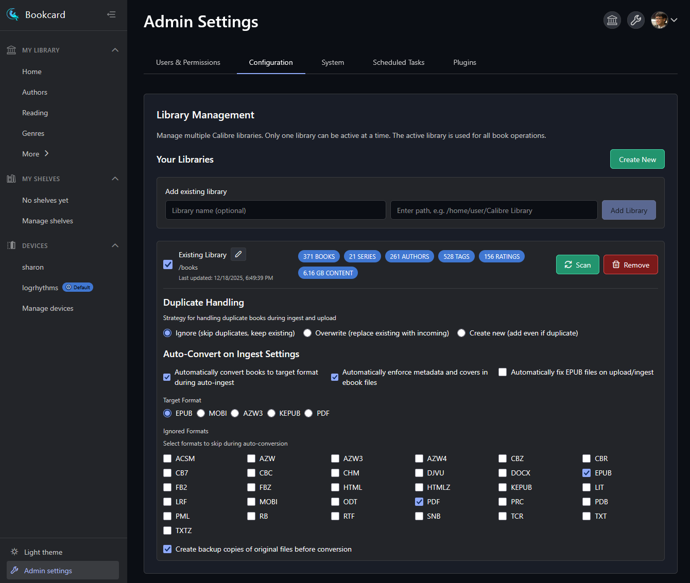

# Library Configuration

This section explains how to manage your Calibre libraries within Bookcard. You can access these settings by navigating to **Settings > Admin > Configuration**.

{ width="800" }

## Getting Started

To add a library to Bookcard, you have two options:

1.  **Create New:** Creates a new, empty Calibre library structure.
2.  **Add Existing:** Connects to an existing Calibre library. You simply need to provide the file path to the folder containing your `metadata.db` file.

Once added, you can click the **Active** checkbox to make it the current library.

## Library Statistics

Each library card displays quick statistics about its contents:

-   **Books:** Total number of books.
-   **Series:** Number of book series.
-   **Authors:** Unique authors count.
-   **Tags:** Number of tags.
-   **Ratings:** Number of rated books.
-   **Content Size:** Total disk space used by the library.

## Actions

-   **Edit (Pencil Icon):** Change the display name of the library.
-   **Scan:** Triggers a background scan to link your books with external metadata (see [Library Scanning](library-scanning.md)).
-   **Remove:** Removes the library configuration from Bookcard.
    > **Note:** Removing a library **does NOT** delete your books or the `metadata.db` file from your disk. It only removes the reference from Bookcard.

## Duplicate Handling

This setting controls what happens when you upload or ingest a book that already exists in the library (matching by title and author).

-   **Ignore:** Skips the new file. The existing book remains unchanged.
-   **Overwrite:** Deletes the existing book (and its files) and replaces it with the new one.
-   **Create new:** Adds the new book as a duplicate entry.

## Auto-Convert on Ingest

These settings allow Bookcard to automatically process books as they are added to the library.

### Automatically convert books to target format
When enabled, Bookcard will attempt to convert incoming books to your preferred format (e.g., EPUB).

-   **Target Format:** Select the format you want all books to be converted to (e.g., EPUB, MOBI, AZW3).
-   **Ignored Formats:** Select formats that should **NOT** be converted. For example, you might want to convert everything to EPUB, but keep PDFs as they are.
-   **Create backup copies:** If enabled, the original file (e.g., the `.mobi` file) will be preserved alongside the converted `.epub` file.

### Automatically enforce metadata and covers
When enabled, Bookcard will update the internal metadata of the ebook file (e.g., the metadata inside the EPUB) to match the metadata in your library database. This ensures that when you send the file to a device, it has the correct cover, title, and author.

### Automatically fix EPUB files
When enabled, Bookcard runs an EPUB repair tool on incoming files. This can fix common structural errors that might prevent books from opening in some readers.
