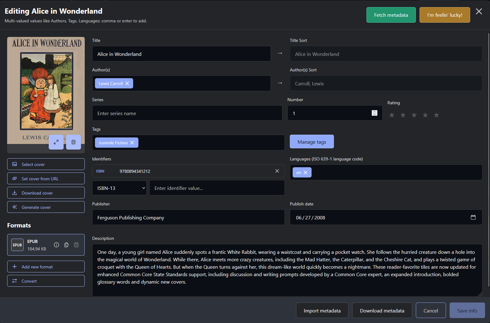
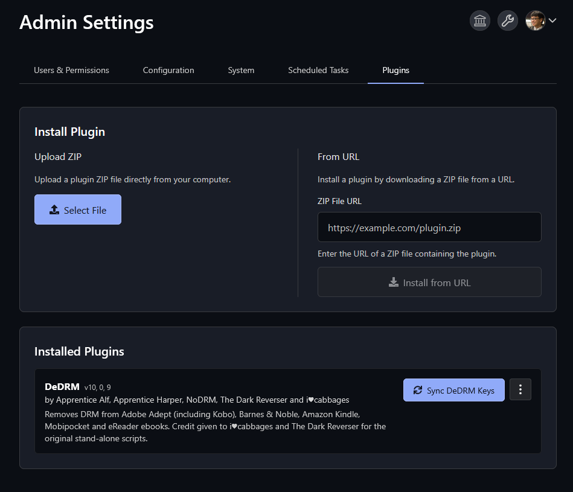
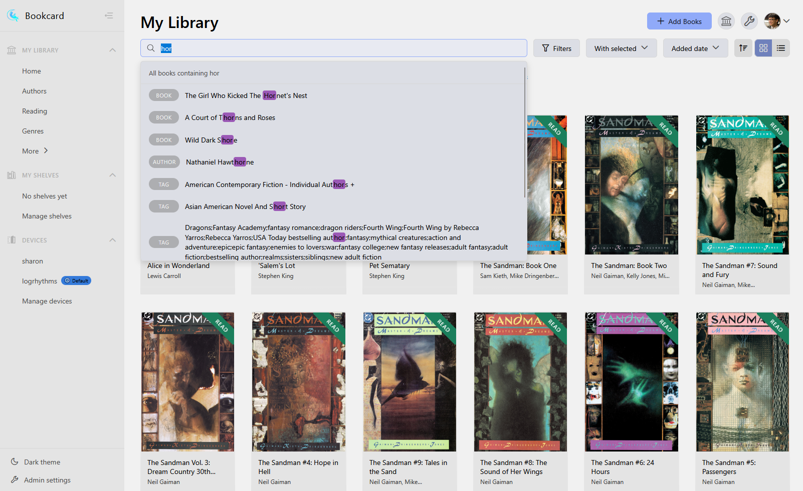
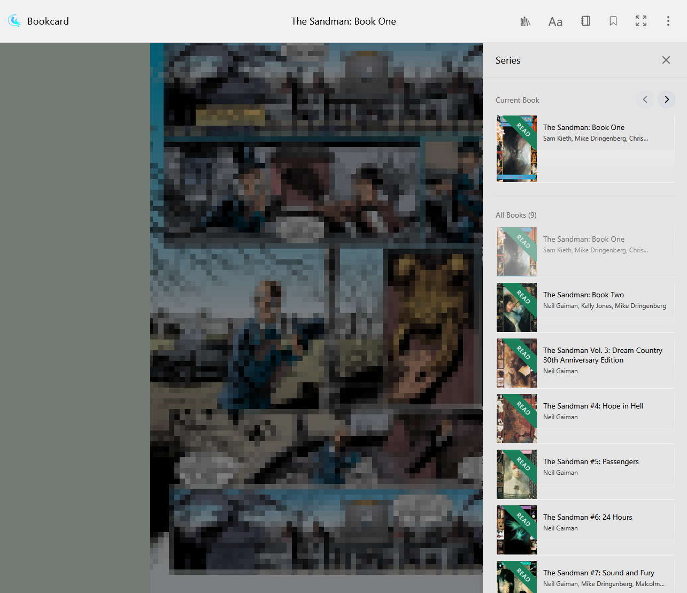

# Screenshots

This gallery showcases the key features and interface of Bookcard. Click on any image to view it in full size in a lightbox.

-   :material-home:{ .lg .middle } __Homepage__

    ---

    

    The main library view showing your book collection with search and filtering options.

-   :material-book-open-page-variant:{ .lg .middle } __Book View Modal__

    ---

    

    Detailed view of a book with metadata, reading options, and management tools.

-   :material-book-edit:{ .lg .middle } __Book Edit Modal__

    ---

    

    Edit book metadata, cover images, and other details.

-   :material-cloud-search:{ .lg .middle } __Fetch Metadata__

    ---

    

    Search for and import metadata from external providers like Google Books and Amazon.

-   :material-account-multiple:{ .lg .middle } __Users & Permissions__

    ---

    

    Create and manage users, assign roles, and configure granular permissions.

-   :material-puzzle:{ .lg .middle } __Plugin Installation__

    ---

    

    Install and manage Calibre plugins like DeDRM directly from the admin interface.

-   :material-library:{ .lg .middle } __Library Configuration__

    ---

    

    Manage multiple libraries, configure auto-conversion, and set duplicate handling rules.

-   :material-palette:{ .lg .middle } __Reader Themes__

    ---

    

    Customize your reading experience with different themes and font settings.

-   :material-magnify:{ .lg .middle } __Search in Book__

    ---

    

    Search functionality within the book reader to find specific content.

-   :material-magnify:{ .lg .middle } __Search Pane (Light Theme)__

    ---

    

    The search pane in light mode, showing search results with context.

-   :material-view-list:{ .lg .middle } __List View (Light Theme)__

    ---

    

    The library list view in light mode, offering a compact and sortable table layout.

-   :material-account:{ .lg .middle } __Author Page__

    ---

    

    View all books by a specific author with detailed information.

-   :material-book-multiple:{ .lg .middle } __Comic Series View__

    ---

    

    Organized view for comic book series and collections.

-   :material-cog:{ .lg .middle } __Comic Settings__

    ---

    

    Configure settings specific to comic book reading and display.

